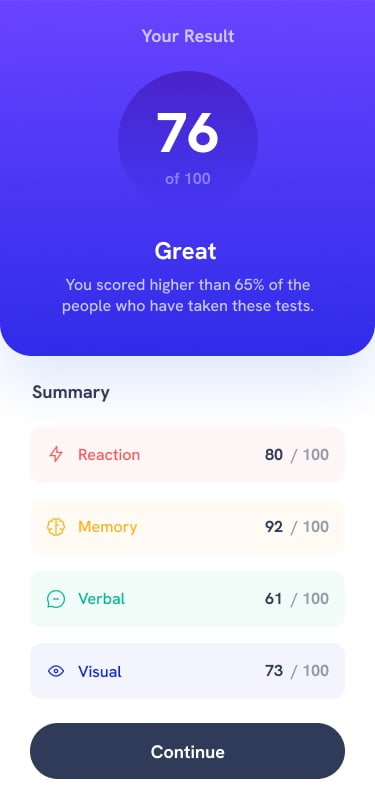

# Frontend Mentor - Results summary component solution

This is a solution to the [Results summary component challenge on Frontend Mentor](https://www.frontendmentor.io/challenges/results-summary-component-CE_K6s0maV). Frontend Mentor challenges help you improve your coding skills by building realistic projects. 

## Table of contents

- [Overview](#overview)
  - [The challenge](#the-challenge)
  - [Screenshot](#screenshot)
  - [Links](#links)
- [My process](#my-process)
  - [Built with](#built-with)

## Overview

### The challenge

Users should be able to:

- View the optimal layout for the interface depending on their device's screen size
- See hover and focus states for all interactive elements on the page
- **Bonus**: Use the local JSON data to dynamically populate the content

### References Screenshots

### Links

- Solution URL: https://www.frontendmentor.io/solutions/social-links-profile---html-and-css-responsive-card-component-M5FxScOFyj
- Live Site URL: https://samuelabreu74.github.io/Social-links-profile/ 

## My process

### Built with

- Semantic HTML5 markup
- CSS responsive style
- Vanilla JavaScript to fetch data
- Flexbox
- Mobile-first workflow

## Author

- Frontend Mentor - [@SamuelAbreu74](https://www.frontendmentor.io/profile/SamuelAbreu74)
- Instagram - [@samuelabreu.dev](https://www.instagram.com/samuelabreu.dev/)
